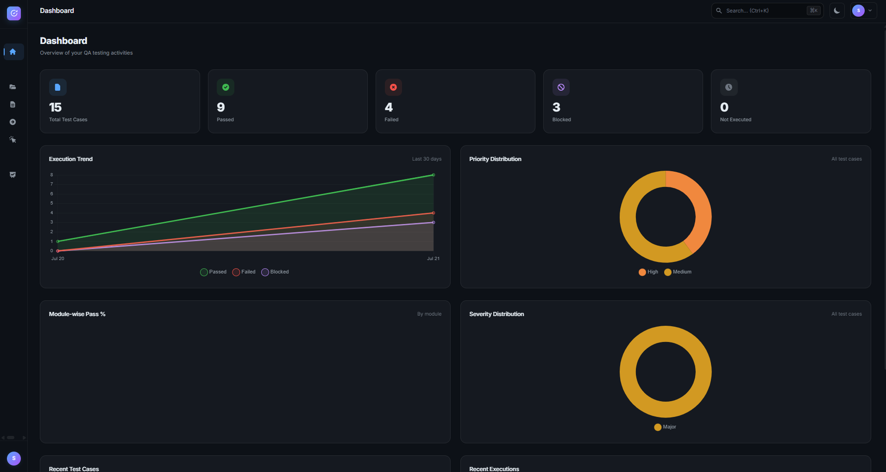
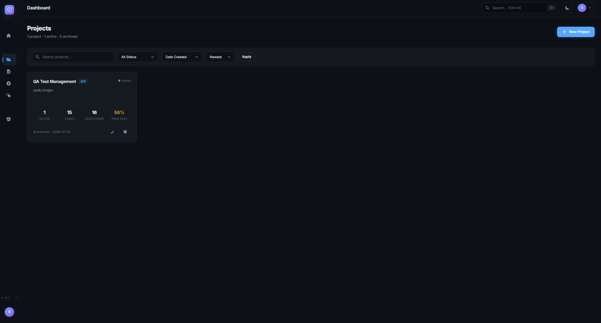

# TestVault — QA Test Management System

A modern, enterprise-grade QA Test Management System built with Flask and SQLite. Designed to demonstrate professional QA engineering skills with a premium SaaS-style UI inspired by Linear, Notion, and GitHub.

**Runs instantly on any Windows machine. No MySQL, no PostgreSQL, no database setup required.**


## Quick Start

```bash
pip install -r requirements.txt
python run.py
```

Open `http://localhost:5000` → Register an account → Start managing tests.

That's it. No database installation. No configuration. The SQLite database is auto-created on first run.

## Features

- **Secure Authentication** — Login/Register with bcrypt-strength password hashing (pbkdf2:sha256)
- **Dashboard** — Real-time stats, execution trends, module-wise pass %, priority/severity distribution
- **Project Hierarchy** — Projects → Test Suites → Test Cases
- **Test Case Management** — Full CRUD, duplicate, search, filter by priority/severity/module
- **Execution Tracking** — Pass/Fail/Blocked/Not Executed with notes and environment info
- **Bug Linking** — Link bugs to test cases with status tracking
- **Reports** — Summary stats with CSV and Excel export
- **Attachments** — Upload screenshots, logs, and documents
- **Dark/Light Theme** — Toggle between premium dark and light themes
- **Responsive Design** — Works on desktop and tablet
- **Keyboard Shortcuts** — Ctrl+K for search, Escape to close menus
- **Toast Notifications** — Animated feedback for all actions
- **Pagination** — On all list views

## Tech Stack

| Layer | Technology |
|-------|-----------|
| Frontend | HTML5, CSS3, JavaScript (vanilla, no frameworks) |
| Backend | Python 3.10+, Flask 3.0 |
| Database | SQLite (Python built-in, zero-install) |
| Charts | Chart.js 4.x (CDN) |
| Export | openpyxl (Excel), csv (Python stdlib) |
| Auth | Werkzeug password hashing + Flask sessions |

## Installation

### Prerequisites
- Python 3.10+ (with pip)

### Setup

```bash
# Clone the repository
git clone https://github.com/yourusername/qa-test-management-system.git
cd qa-test-management-system

# Install dependencies (only 4 packages!)
pip install -r requirements.txt

# Run the application
python run.py
```

### First Use
1. Open `http://localhost:5000`
2. Click "Create one" to register
3. Enter your name, email, and password
4. Login with your credentials
5. Start creating projects and test cases

## Project Structure

```
qa-test-management-system/
├── app/
│   ├── __init__.py              # Flask app factory + DB init
│   ├── config.py                # Configuration
│   ├── models/                  # Data access layer
│   │   ├── user.py              # Authentication model
│   │   ├── project.py           # Project CRUD
│   │   ├── test_suite.py        # Test Suite CRUD
│   │   ├── test_case.py         # Test Case CRUD + filters
│   │   ├── execution.py         # Execution tracking + stats
│   │   ├── bug_link.py          # Bug linking
│   │   └── attachment.py        # File attachments
│   ├── routes/                  # HTTP route handlers
│   │   ├── auth.py              # Login/Register/Logout
│   │   ├── dashboard.py         # Dashboard + JSON APIs
│   │   ├── projects.py          # Project management
│   │   ├── test_suites.py       # Suite management
│   │   ├── test_cases.py        # Test case management
│   │   ├── executions.py        # Test execution
│   │   ├── bug_links.py         # Bug linking
│   │   └── reports.py           # Reports + export
│   ├── utils/                   # Shared utilities
│   │   ├── database.py          # SQLite connection + query helper
│   │   ├── helpers.py           # Auth decorator, pagination, file ops
│   │   └── export.py            # CSV/Excel export
│   ├── static/
│   │   ├── css/                 # Custom theme system (no Bootstrap)
│   │   ├── js/                  # Dashboard charts, theme, shortcuts
│   │   └── uploads/             # User file uploads
│   └── templates/               # Jinja2 HTML templates
├── database/
│   ├── schema.sql               # SQLite schema (auto-applied)
│   └── seed_data.sql            # Demo data (optional)
├── requirements.txt             # Only 4 dependencies
├── run.py                       # Entry point
├── .env                         # Configuration
├── .gitignore
└── README.md
```

## Database

SQLite database is stored at `database/qa_test_management.db`. It is:
- **Auto-created** on first `python run.py`
- **Auto-migrated** — schema.sql uses `CREATE TABLE IF NOT EXISTS`
- **Portable** — copy the .db file to move all data
- **Zero-config** — no host, port, user, or password needed

### Schema
- `users` — Authentication
- `projects` — Top-level organization
- `test_suites` — Groups of test cases within a project
- `test_cases` — Individual tests with priority, severity, steps
- `executions` — Pass/Fail/Blocked/Not Executed records
- `bug_links` — Bugs linked to failing test cases
- `attachments` — Screenshots, logs, documents
- `activity_log` — Audit trail

### Loading Demo Data (Optional)

After registering your first user, you can load sample data:

```bash
sqlite3 database/qa_test_management.db < database/seed_data.sql
```

## Architecture

- **MVC Pattern** — Models (data), Routes (HTTP), Templates (UI)
- **Blueprint-based** — Each module is a separate Flask blueprint
- **Session Auth** — Secure password hashing + Flask sessions
- **Custom CSS** — No Bootstrap, no Tailwind — 100% handcrafted
- **Theme System** — CSS custom properties for dark/light toggle
- **MySQL-Ready** — All models use %s placeholders; migration back to MySQL requires only swapping database.py

## Screenshots

### Dashboard


### Projects


### Test Cases


### Execution History


### Bug Tracker


### Reports & Analytics


## License

MIT License

---

**Built as a portfolio project demonstrating professional QA Engineering and Full Stack Development skills.**
